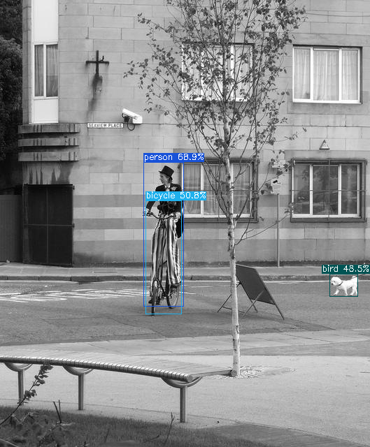

## test_ncnn
> test_ncnn 用于开发环境上调试各个算法模型

### build for window
```shell

```

### build for Mac
```shell
brew update

brew install opencv
brew install ncnn
```

### build for linux(ubuntu)
```shell

```


### get start

1. `main.cpp` 引入任意子目录算法头文件, 以`nanodet_plus/nanodet.h`为例:
```c++
#include "nanodet_plus/nanodet.h"
#include "net.h"

int main(){
    nanodet_plus::test_nanodet_plus();
    return 0;
}
```

2. 测试效果:

